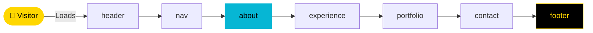

<div align="center">


[](https://git.io/typing-svg)

<br/>

<p align="center">
  <a href="https://github.com/NietoDeveloper">
    
  </a>
  <a href="https://committers.top/colombia#NietoDeveloper">
    
  </a>
  <a href="https://react.dev/">
    
  </a>
  <a href="https://create-react-app.dev/">
    
  </a>
  <a href="https://opensource.org/licenses/MIT">
    
  </a>
</p>

<p align="center">
  <a href="https://github.com/NietoDeveloper/ReactBriefcaseExample">
    
  </a>
</p>

</div>

---

## 📋 Overview

**Briefcase Example** is a reusable React portfolio boilerplate, structured around clean, modular section components — About, Experience, Portfolio, and Contact — ready to be customized and reused across personal or client portfolio sites. Bootstrapped with [Create React App](https://github.com/facebook/create-react-app).

---

## 🗂️ Project Structure

```text
ReactBriefcaseExample/
├── public/
└── src/
    ├── assets/
    └── components/
        ├── about/
        ├── contact/
        ├── experience/
        ├── footer/
        ├── header/
        ├── nav/
        └── portfolio/
```

---

## 🔄 Portfolio Page Flow



---

## 🛠️ Tech Stack

<div align="center">

| Layer | Technologies |
|:------|:-------------|
| 🎨 **Frontend** | React (Create React App) |
| 🔧 **Version Control** | Git / GitHub |

</div>

---

## 🚀 Available Scripts

In the project directory, you can run:

### `npm start`

Runs the app in development mode. Open [http://localhost:3000](http://localhost:3000) to view it in your browser.

The page will reload when you make changes. You may also see any lint errors in the console.

### `npm test`

Launches the test runner in interactive watch mode. See the section about [running tests](https://facebook.github.io/create-react-app/docs/running-tests) for more information.

### `npm run build`

Builds the app for production to the `build` folder. It correctly bundles React in production mode and optimizes the build for the best performance.

The build is minified and the filenames include the hashes. Your app is ready to be deployed!

See the section about [deployment](https://facebook.github.io/create-react-app/docs/deployment) for more information.

### `npm run eject`

**Note: this is a one-way operation. Once you `eject`, you can't go back!**

If you aren't satisfied with the build tool and configuration choices, you can `eject` at any time. This command will remove the single build dependency from your project.

Instead, it will copy all the configuration files and the transitive dependencies (webpack, Babel, ESLint, etc.) right into your project so you have full control over them. All of the commands except `eject` will still work, but they will point to the copied scripts so you can tweak them. At this point you're on your own.

You don't have to ever use `eject`. The curated feature set is suitable for small and middle deployments, and you shouldn't feel obligated to use this feature. However, we understand that this tool wouldn't be useful if you couldn't customize it when you are ready for it.

---

## 👨‍💻 Author

**Manuel Nieto (NietoDeveloper)**

---

## 📄 License

This project is licensed under the **MIT License**.

<div align="center">

<br/>


</div>


<div align="center">


[](https://git.io/typing-svg)

<br/>

<p align="center">
  <a href="https://github.com/NietoDeveloper">
    
  </a>
  <a href="https://committers.top/colombia#NietoDeveloper">
    
  </a>
  <a href="https://react.dev/">
    <img src="https://img.shields.io/badge/